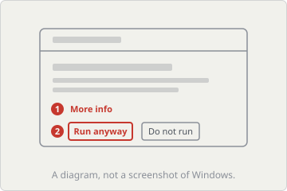
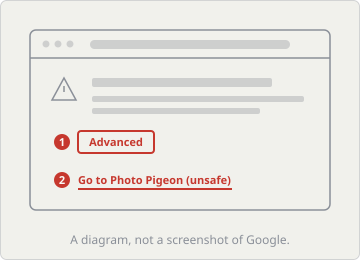
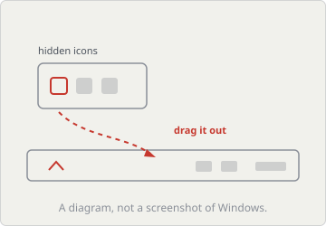

<p align="center">
  
</p>

<h1 align="center">Photo Pigeon</h1>

<p align="center">
  <a href="https://github.com/justerlex/photo-pigeon/actions/workflows/ci.yml"></a>
  
  <a href="LICENSE"></a>
</p>

<!-- The npm version badge belongs in the row above, on the day the package is
     published and not before: https://img.shields.io/npm/v/photo-pigeon?style=flat -->

**Back up photos to Google Photos automatically, on Windows.** Point Photo Pigeon
at a folder. Everything new that lands there is carried to your Google Photos
library in the background, with nothing to keep open and nothing to remember.

Google is closing the Drive for desktop route into Google Photos on 10 August
2026. Its replacement, "Back up folders" on photos.google.com, wants a browser
tab or an installed PWA left running, and a browser with the File System Access
API, which Firefox and Safari do not have. Photo Pigeon is the small desktop tool
that fills the gap: an auto upload folder watcher that needs no tab open,
survives a reboot, and does not care which browser you use.

---

## What it does

- **Watches the folders you name** and delivers anything new to Google Photos.
- **Remembers every delivered file by its sha256**, so nothing is sent twice,
  even after you rename it or move it between folders.
- **Lives in the Windows tray**, starts with Windows if you let it, and keeps
  itself up to date without interrupting an upload.
- **Runs from a terminal too**, one `npx` away, on the same configuration.
- **Uses your own Google credentials**, so the daily upload allowance is yours
  alone and nobody else shares it.

## What it never does

**It never deletes and it never edits.** The only permission it asks Google for
is `photoslibrary.appendonly`, and there is no delete behind that word. Every
version of this tool will be upload only.

**It never takes your delivery record with it.** `~/.photo-pigeon/ledger.jsonl`
is the local list of what has been delivered, and it sits outside everything the
uninstaller touches, so an uninstall cannot cost you a re-upload of your whole
library.

**It never hides what an upload costs.**

> Uploads are original quality and count against your Google storage. Storage Saver does not apply.

That is Google's rule for anything uploaded through their API rather than a
setting this tool can flip, so it is on the first setup screen, in the status
window and in the tray tooltip. The running byte total is in the status window
and in `photo-pigeon status`.

No telemetry, no account with us, and no credentials shipped in the installer.
The only place your photos go is your own Google Photos library.

## Install

**The installer.** Download the `.exe` from the
[latest release](https://github.com/justerlex/photo-pigeon/releases/latest) and
run it. It installs for you alone, into `%LOCALAPPDATA%\Photo Pigeon`, needs no
administrator password, and puts **Photo Pigeon** in the Start Menu. Windows 10
or 11, 64-bit.

**Windows will stop you the first time.** You get a blue box saying **Windows
protected your PC** with **Unknown publisher** where a name should be, and no Run
button anywhere on it. Two clicks, in this order:

1. **More info**
2. **Run anyway**

<p align="center">
  
</p>

Windows does that to every program from a publisher it holds no certificate for,
whatever the program does. This one is unsigned because certificates cost money
every year and this is a free tool. SignPath Foundation gives them to open source
projects, and asks that a project is already released in the form to be signed,
so the application goes in with this first release rather than before it. When it
lands, the publisher line will read **SignPath Foundation** rather than any name
of this project, because that is whose certificate it is.

**Prefer a terminal?** With Node 20 or newer, `npx` runs Photo Pigeon without
installing anything:

```
npx photo-pigeon setup
npx photo-pigeon watch
```

Same wizard, same configuration, same delivery record. The tray runs the command
line's own compiled core as a child process, so there is one program here and not
two.

| Command | What it does |
|---|---|
| `photo-pigeon setup` | The five-step walkthrough. `init` is an alias. |
| `photo-pigeon watch` | Watch and upload. The default, so plain `photo-pigeon` does it too. |
| `photo-pigeon watch --once` | One pass, then exit. Exit code 3 means at least one file did not make it, so a scheduled task can tell. |
| `photo-pigeon status` | What has been delivered, what it cost in bytes, what is configured. |
| `photo-pigeon doctor` | Checks the things that quietly break, a consent screen left in Testing first among them. |
| `photo-pigeon login` | Sign in again. `auth` is an alias. |
| `photo-pigeon folders add <path>` | Add or `remove` a watched folder. |

`--dry-run` on `watch` says what it would send, sends nothing, and does not even
sign in. `photo-pigeon watch --help` has the rest.

## First run

The setup window opens by itself on a machine with no configuration yet: five
screens in your browser, most of them one button, each one opening the exact
Google page it needs. You end up with your own Google Cloud project, your own
daily upload allowance and credentials that live only on this machine. Nothing is
shared with anybody, including us. The one step worth not skipping is publishing
the consent screen, because Google expires an unpublished app's sign-in every
seven days, so the wizard stops there and asks, and the health check watches it
afterwards. Google also shows a full page saying it has not verified this app,
which is what it says about every app that has not been through its review,
including the one you just made for yourself.

<p align="center">
  
</p>

**If you cannot see the bird afterwards, it is in the overflow.** Windows 11
hides new tray icons behind the small arrow by default. Click the arrow, drag the
pigeon onto the taskbar once, and it stays there.

<p align="center">
  
</p>

## Languages

**Translations are welcome, and one file is a whole translation.** Copy
`app/ui/locales/en.json` to `app/ui/locales/<code>.json`, translate the values,
leave the keys alone, and add one line naming your language in `app/ui/i18n.js`.
No build step and nothing generated. A half finished file is a good contribution:
any key you have not translated falls back to English by design.
`CONTRIBUTING.md` has the recipe, including the one thing the tests are strict
about, which is leaving the `{tokens}` intact.

The tray menu, the notifications and the sentences the engine sends are still
English only. Moving them into the same file is the next version's headline work.

**Credit comes with it.** A merged translation puts your name and your language
in the list below, and in the release notes of the version it first ships in.

### Translators

This list is empty and waiting for its first name.

## Development

Windows, Node 20 or newer, and the Rust stable MSVC toolchain for the tray shell.

```
npm ci
npm test          # the core suite
npm run build     # tsc, into dist/
```

The shell needs the core staged as a sidecar first, because both directories it
is staged into are generated and gitignored, so a fresh clone has neither:

```
node app/scripts/build-sidecar.mjs     # builds the core and stages it
cd app/src-tauri && cargo test         # the shell suite
```

Then, from `app/`: `npm run dev` runs the tray, and `npm run build -- --no-sign`
makes the installer. The flag is not decoration, and `CONTRIBUTING.md` says why,
along with the copy laws, the translation recipe and what a pull request is
expected to carry.

The design is written down at length in `docs/TRAY-DESIGN.md`, `PROBE.md` holds
what was measured against Google's API, and `app/e2e/CHECKLIST.md` holds the
passes a machine cannot walk.

## Code signing policy

Releases of this project are currently **unsigned**, and the Install section
above says what Windows shows because of it. An application to SignPath
Foundation went in with the first release.

If and when it is granted, free code signing is provided by
[SignPath.io](https://signpath.io), with the certificate issued by the
[SignPath Foundation](https://signpath.org). The publisher line a user reads on a
signed build will say **SignPath Foundation**, because that is whose certificate
it is, rather than any name belonging to this project.

**Team roles.** This is a single-maintainer project, and all three roles are held
by the same person, which is stated plainly rather than dressed up:

| Role | Who | What it means here |
|---|---|---|
| Authors | [@justerlex](https://github.com/justerlex) (Alexander Yermakov) | trusted to modify the source |
| Reviewers | [@justerlex](https://github.com/justerlex) | approves pull requests before they merge |
| Approvers | [@justerlex](https://github.com/justerlex) | authorises a release to be signed |

Every release is approved for signing by hand. Nothing in this repository signs
itself, and no automation holds that authority.

**Privacy policy:** [PRIVACY.md](PRIVACY.md). The short version is that your
photos go to your own Google Photos library and nowhere else, nothing is
transferred before you finish the setup wizard, and there is no telemetry of any
kind.

**Code of conduct:** [CODE_OF_CONDUCT.md](CODE_OF_CONDUCT.md).

## License

MIT, Alexander Yermakov (justerlex). See [LICENSE](LICENSE).
